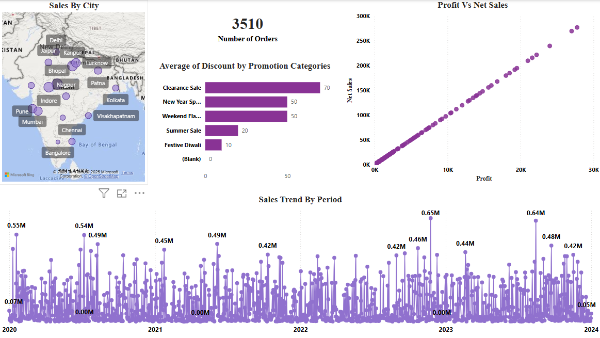

# 📊 ElectroHub Power BI Dashboard

---

## 📊 ElectroHub Dashboard Visuals

### 🔹 1. Overview  

---

### 🔹 2. Top & Bottom 5 Products by Sales, Profit, Quantity Sold  

---

### 🔹 3. Comparison of Sales, Profit & Quantity Between Two Time Periods  

---

### 🔹 4. Order-Level Table with Filters (Date, Customer, Product, Promotion)  

---

## 🔍 Project Overview

This Power BI dashboard provides dynamic visual insights into various sales metrics such as profit, quantity sold, discounts, and order volume across different periods and locations.

---

## ✅ Objectives

- Identify **Top/Bottom 5 Products** by:
  - Sales  
  - Profit  
  - Quantity Sold  
- Analyze **Sales Trends** over time:
  - Daily  
  - Monthly  
  - Quarterly  
  - Annually  
- Show **Relationship Between Sales and Profit**
- **Compare KPIs** between any two selected time periods:
  - Sales  
  - Profit  
  - Quantity Sold  
- Display **Average Discount Offered** in each discount category
- Show **Total Number of Orders**
- Create a filterable report using:
  - Product  
  - Date  
  - Customer ID  
  - Promotion Category  
- Visualize **Sales by Different Cities**

---

## 📁 Project Files

- `Cleaned_Data.xlsx` – Structured and cleaned dataset  
- `ElectroHub_Dashboard.pbix` – Power BI report file  
- `README.md` – Documentation for the project

---

## 🛠 Tools Used

- **Power BI** – For dashboard and data visualization  
- **Microsoft Excel** – For data cleaning and preprocessing

---

## 📈 Key Features

- **Interactive Filters and Slicers**  
  Explore insights by selecting custom time periods, product types, and more.

- **Time-Based Trend Analysis**  
  Visuals broken down by day, month, quarter, and year.

- **Dynamic Comparison View**  
  Compare key metrics between any two periods selected by the user.

- **Detailed Drill-Down**  
  Dive into order-level details with dynamic filtering.

---

## 🙋‍♂️ About Me

**👨‍💼 Dhruv Nirwan**  
Data Analyst | Power BI | SQL | Excel | Python | Snowflake | Cloud (AWS, Azure, GCP)  

🔗 [LinkedIn](https://www.linkedin.com/in/dhruv-nirwan)  
📧 dhruvnirwan836@gmail.com  
📂 [GitHub: dhruvnirwan](https://github.com/dhruvnirwan)

